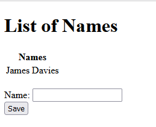

# session1-containers

This is the starting point for session 1. We will be taking this application and putting it inside a container.

This is a very simple application which serves up some names populated from the `names.json` file, from a webserver and allows us to add new names to this list.

To run the application as is, run the correct binary inside the `bin/` for your OS. E.g:
```
$ bin/server-windows-amd64 
2022/05/02 14:16:19 Starting Name Server
2022/05/02 14:16:19 Serving on http://localhost:8766
```
Visiting the endpoint provided should show a a table populated with names:



If you can run this application, you can now move onto the next branch `step1-building-your-application`
