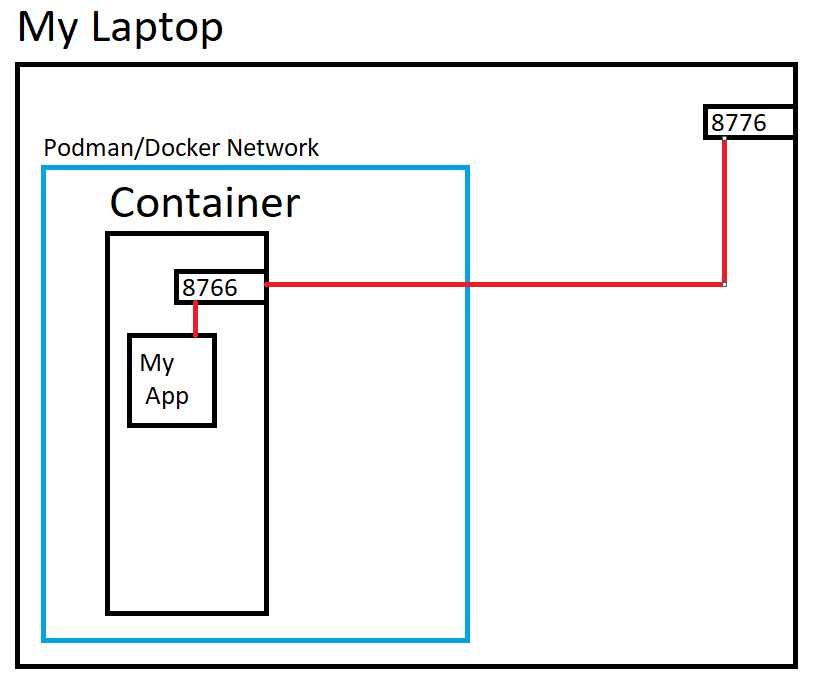

# session1-containers

So after we have run the `build` command against our dockerfile and our build has completed successfully, we are ready to start thinking about running our container.

*IMPORTANT* If you are using WSL or a VM on your windows machine you will need to access your application through its IP address rather than localhost. One way you can find out the IP is to run a `ip addr` and look at the inet address for the eth0 network adapter. Then rather than using localhost, use that ip instead.

### Running our application

To demonstrate a few principals we are goingt to be running our application a few times, but that basic run command is:
```
podman run myimage:v1
```
which will start up our application. But the stdout for our container will be our terminal, locking its use for that thread. If we wish to run our container without locking out terminal, we can add a flag of `-d` or `--detach` to run headlessly

If we run in detached mode, the container id is returned to the terminal.

Running a `podman ps` should show us something like this:
```
CONTAINER ID  IMAGE                         COMMAND     CREATED        STATUS            PORTS       NAMES
eeb1fb0173a0  docker.io/library/myimage:v1              3 seconds ago  Up 4 seconds ago              friendly_shtern
```
You can notice that a name has been provisioned for this container aswell as an id. This is something that can be set, but be aware that names have to be unique to all containers running.

*Top Tip* You may have noticed that the id given from the `run` command and the id shown in the `ps` are different lenghts. The id from the run command is the full id for our container, but shorter versions can be used to identify our running application. Both the docker and podman CLI tools will allow you to use any length of id, again as long as it is unique compared to every other running pod. For example i can use the command `podman stop eeb` and it would stop our application, assumming no other ID's started with `eeb`.

So now lets try accessing our application: if we go to `http://localhost:8766` you will notice that we cannot reach our application. This is for multiple reasons which can be describe by this diagram:


When we install and use podman or docker, it creates its down subnet, which runs through a different network adaptor on your machine. And the normal behaviour when we go to the address `http://localhost` is for it to be resolved and routed through a different network adaptor called `lo`, which directs any connections to the host machine itself. So when we go to `http://localhost:8766`, we are actually looking at the port 8766 on out machine and not the 8766 on the container.

Thankfully docker and podman provide an easy way to redirect traffic to internally running containers. We could of done a `podman inspect <containerID>` and found the provisioned IP address for the container, and accessed it that way, but a more dynamic and useful way to connect to our app, is to have a bridge put in place to access through the typical localhost of out machine. 

This is done at runtime like this:
```
podman run -d -p 8777:8766 myimage:v1
```
Here the `-p` or `--expose` flag are used to describe the ports we wish to bridge between in the format of `HOST:CONTAINER`, so something like this happens:



So if we now try and go to `http://localhost:8776`, we should see our application running.

Now run`podman ps` command, and you should see something like this:
```
CONTAINER ID  IMAGE                         COMMAND     CREATED         STATUS             PORTS                   NAMES
eeb1fb0173a0  docker.io/library/myimage:v1              32 minutes ago  Up 32 minutes ago                          friendly_shtern
fe7c045573d2  docker.io/library/myimage:v1              7 seconds ago   Up 7 seconds ago   0.0.0.0:9876->8766/tcp  flamboyant_banzai
```
Firstly you will notice that there are now two containers running. This is because the podman run command creates and starts an instance of a container. If we want to start/stop conmtainers, we can do with a command like `podman start eeb / podman stop eeb`.

You will also notice `0.0.0.0:9876->8766/tcp` which tells us two things.
1. The port 9876 from ANY ip address (in CIDR), will be routed to the port 8766 on this container
2. It will accept TCP packets

These can be configured if nessesary e.g: `podman run -d -p 127.0.0.1:8777:8766 myimage:v1` would limit only traffic coming from a localhost to access my container.

## Holding state

In this simple application, we actually use a local file as a database instead of another service elsewhere. This was intentionally done to demonstrate how we can hold state information (will cover more in the kubernetes session) within a container. As typically we explain a containers runtime to be held in a purely ephemeral state. This way we can throw away and restart containers with little consequence, assuming they are setup correctly (hint: we currently are not).

In a local environment like this, the problem is not that apparent, as I can start my container, add some names to the list, stop my application, then start it back up, and the information would still be held. But this is because the standard docker/podman runtimes dont throw away containers after they are stopped (useful for development), but this isnt true in a cloud environment. If a container stops (whether a crash or a shutdown) the entire container runtime is disposed of. This means in my example I cannot not just write a file out to the filesystem, and expect it to always be there. (This could also be an issue if i wished to increase the number of instances of my application whilst talking to the same data)

So we manage this by mounting persistent storage to our containers, which we expect and manage appropriately to be long lived. This way if i have multiple instances, or a restarted instance, they mount any data and carry on normal execution.

There are a couple of options to doing this:
1. We can mount a portion of the hosts filesystem to the container (useful way of passing configurations, anything we want the container to work on but still be able to access from the host machine.)
2. We can create a `volume` as some block storage that we can directly mount to the application.

Lets look at number two, as this also links well into the second session next time. Running:
```
podman volume create my-app-data
```
Creates a volume that we can see with a `podman volume ls` command. This volume will be expanded as necessary (but by default limited to 10Gb)

We can then start a new instance of our application up with the command:
```
podman run -d -p 9876:8766 -v my-app-data:/data myimage:v1
```
Mounting the volume `my-app-data` onto the dir `/data`

*IMPORTANT* You will notice going to the application in the browser that there are now no names in the application. This is because we mounted a clean block of storage over the location our application is expecting to see the database. Any data added from this point will be safely stored. This is sometimes why mounting an local dir from the host machine can be useful for passing configurations. (similar concepts appear in kubernetes)

You can now move to the `summary` branch
